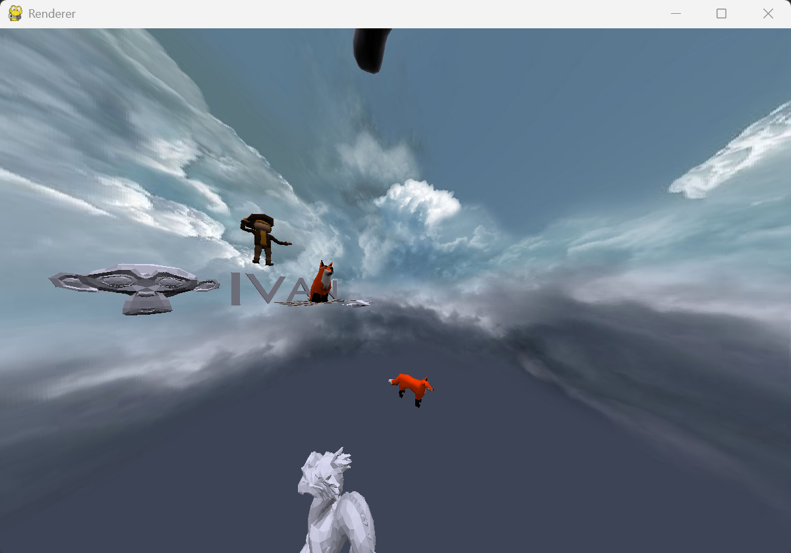
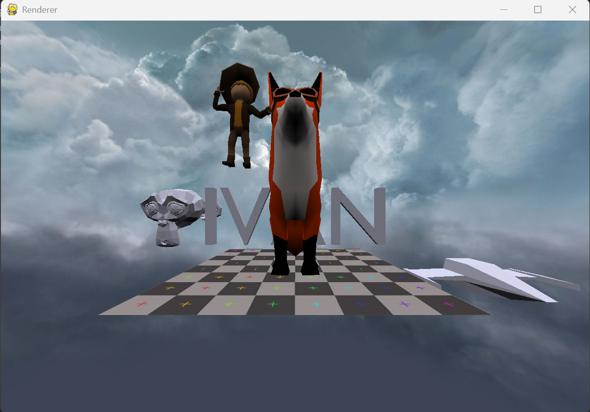

This is a practice project where I try making a 3d engine by following various
online resources.

I picked features I thought I could implement and others I wanted to learn.
It isn't very performant but it can easily be realtime as long as the rasterizer
does not have too many triangles and doesn't have too many pixels to draw.

The main features I implemented and worked on are:
* drawing a triangle
* drawing a collection of triangles
* drawing a transformed triangle
* applying a perspective transform to make it look 3d.
* culling triangles behind the camera to prevent triangles from exploding
* clipping triangles into smaller ones to partially draw triangles intersecting the z axis
* lighting the triangle depending on where the triangle is facing
* texturing triangles by sampling a texture for every pixel
* fixing affine texture mapping by undo-ing the z perspective divide to have perspective correct textures
* implementing normal maps for smooth shading making polygons seem rounder than they actually are (non-affine)  
* writing a shader system similar to how OpenGL has shaders to mimic their interface
* wrote simple shaders to do various things such as properly show the skybox, textured objects, and non-textured objects
* looked for various ways to optimize such as leveraging numpy's ability to vectorize calculations far more efficiently than pure Python can.

## Credits

Used a 3d ship model from javidx9's video:

>javidx9's [Coding Adventure: Making a Game Engine](https://www.youtube.com/watch?v=ih20l3pJoeU) (YouTube).

Used various texture and model objects including the fox and person as well as taking inspiration from the concepts:

>Sebastian Lague's [Software Rasterizer project](https://github.com/SebLague/Software-Rasterizer) (GitHub).